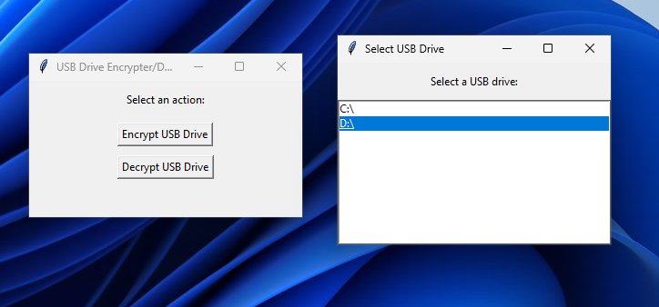
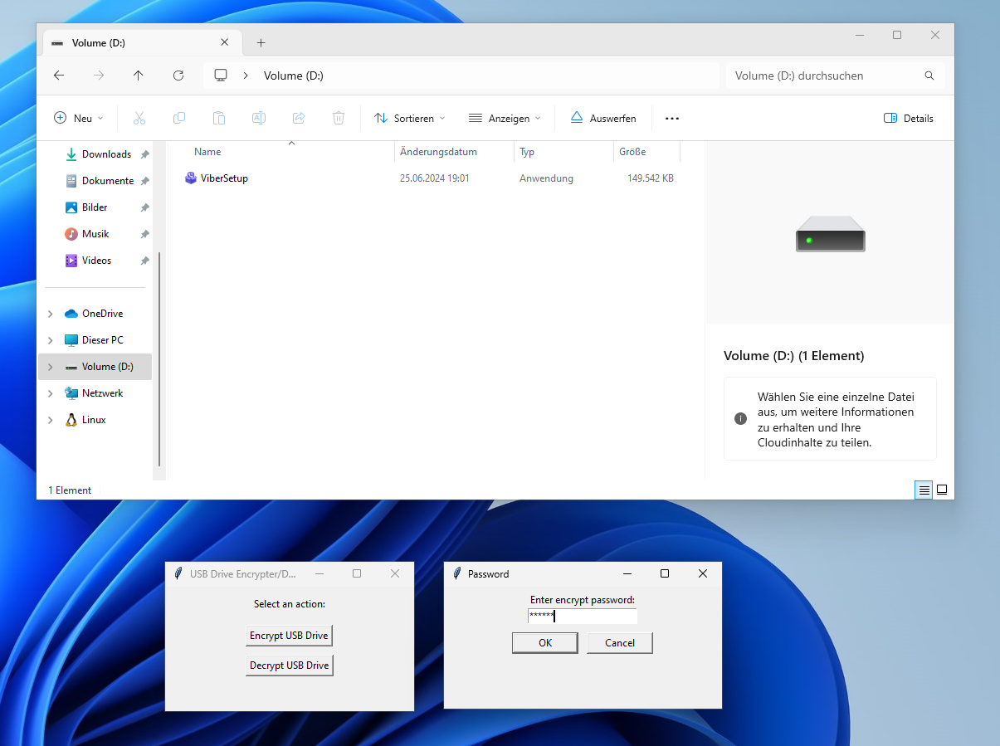
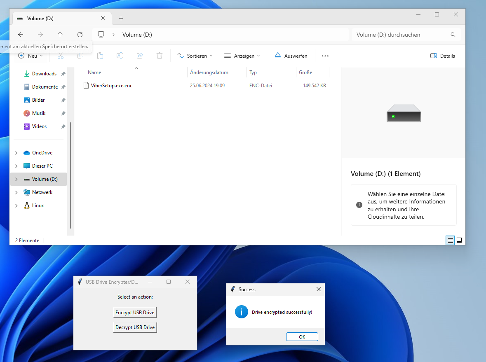

# USB Drive Encrypter/Decrypter

A simple Python application to encrypt and decrypt USB drives using AES encryption. 
This application uses the `cryptography` library to perform the encryption and decryption 
of files on a selected USB drive.

## Features

- Encrypt files on a USB drive with a password
- Decrypt files on a USB drive with a password
- Simple GUI interface to select drives and perform actions

## How It Works:

## Encryption

- Generates a random salt and initialization vector (IV).
- Derives a key from the password using PBKDF2HMAC with the salt.
- Pads the plaintext data to be a multiple of the block size.
- Encrypts the padded data using AES in CBC mode with the derived key and IV.
- Saves the salt, IV, and ciphertext to a new file with the .enc extension.
- Deletes the original file.
  
## Decryption

- Reads the salt and IV from the encrypted file.
- Derives the key from the password using PBKDF2HMAC with the salt.
- Decrypts the ciphertext using AES in CBC mode with the derived key and IV.
- Unpads the decrypted data.
- Saves the original file content.
- Deletes the encrypted file.

## Note

Ensure you remember the password used for encryption, as it is required for decryption.
Be cautious when handling encryption and decryption of large files or drives.

